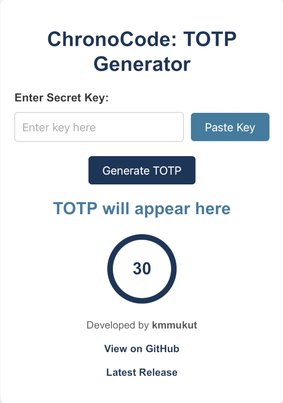

# ChronoCode

**ChronoCode** is a simple and secure TOTP (Time-based One-Time Password) generator for two-factor authentication (2FA).  

🌐 **[Try ChronoCode on the Web](https://kmmukut.github.io/ChronoCode)**  

  
  

---

## Table of Contents
- [Features](#features)
- [How It Works](#how-it-works)
- [Usage](#usage)
- [Preview](#preview)
- [Security](#security)
- [Contributing](#contributing)
- [Author](#author)
- [License](#license)

---

## Features
- ⏰ Generate secure, time-based one-time passwords (TOTP).
- 📋 Clipboard support for easy key pasting and copying OTPs.
- 🔄 Auto-refresh every 30 seconds with countdown visualization.
- 💻 Fully responsive design, works seamlessly on desktop and mobile.
- 📶 Works offline—no internet connection required.

---

## How It Works

1. Enter or paste your Base32-encoded secret key.
2. The app generates a 6-digit OTP code based on the current time.
3. Codes are refreshed every 30 seconds and displayed with a countdown.

---

## Usage

### Web App

You can use ChronoCode directly in your browser without any installation:  
👉 [Try ChronoCode Now](https://kmmukut.github.io/ChronoCode)

1. Open the web app link above.
2. Enter your Base32-encoded secret key.
3. View the generated TOTP code.
4. Codes refresh every 30 seconds with a countdown timer.

---

### Installation (Progressive Web App)

ChronoCode is installable as a PWA for a native app-like experience:

#### On Desktop (Chrome, Edge, Brave, etc.)
1. Open [ChronoCode Web App](https://kmmukut.github.io/ChronoCode) in your browser.
2. Look for the **install button** (a `+` icon) in the address bar or browser menu.
3. Click "Install" to add ChronoCode to your desktop.
4. Launch it from your desktop or start menu as a standalone app.

#### On Mobile (Chrome, Safari, etc.)
1. Open [ChronoCode Web App](https://kmmukut.github.io/ChronoCode) on your phone.
2. Tap the browser menu (three dots in Chrome or the share icon in Safari).
3. Select **"Add to Home Screen"**.
4. ChronoCode will be installed as an app icon on your home screen.
5. Launch it like any other app, and it will work offline!

---

### Steps to Generate a TOTP Code
1. **Enter the Secret Key**: Paste or manually input your Base32-encoded secret key.
2. **View the OTP**: A 6-digit OTP code will be generated instantly.
3. **Countdown Timer**: Observe the timer and use the OTP before it refreshes.
4. **Copy the OTP**: Use the "Copy" button to quickly copy the generated OTP.

---

### Why Install the App?

- 🚀 **Faster Access**: Launch the app like a native application.
- 🌐 **Works Offline**: Generate OTPs even without an internet connection.
- 🔒 **Secure**: All computations happen locally in your browser.

---
### Browser Extension

For quick and convenient OTP generation, ChronoCode is also available as a browser extension. Install it on your favorite browser for easy access while browsing.

#### Available Platforms:

- **Mozilla Firefox**:  
  [Get ChronoCode on Firefox Add-ons](https://addons.mozilla.org/en-US/firefox/addon/chronocode/?utm_source=addons.mozilla.org&utm_medium=referral&utm_content=search)

- **Chromium-Based Browsers** (e.g., Chrome, Edge, Brave, Opera):  
  [Get ChronoCode on Chrome Web Store]([https://chromewebstore.google.com/detail/mmjimeoahbfhkkdceblagacfgffebbdd/preview?hl=en&authuser=1&pli=1](https://chromewebstore.google.com/detail/chronocode-totp-generator/mmjimeoahbfhkkdceblagacfgffebbdd?hl=en&authuser=1))

#### Features of the Browser Extension:
- 🚀 **Quick Access**: Generate OTPs directly from your browser toolbar.
- 🔒 **Secure**: All computations are performed locally.
- 🔄 **Synchronization**: Works seamlessly across multiple tabs and sessions.
- 🌐 **Cross-Browser Support**: Compatible with both Firefox and Chromium-based browsers.

---

### Installation Steps:

1. **Mozilla Firefox**:
   - Visit the [Firefox Add-ons page](https://addons.mozilla.org/en-US/firefox/addon/chronocode/?utm_source=addons.mozilla.org&utm_medium=referral&utm_content=search).
   - Click "Add to Firefox."
   - Follow the on-screen prompts to install.

2. **Chromium-Based Browsers**:
   - Visit the [Chrome Web Store page](https://chromewebstore.google.com/detail/mmjimeoahbfhkkdceblagacfgffebbdd/preview?hl=en&authuser=1&pli=1).
   - Click "Add to Chrome."
   - Confirm installation when prompted.

---

### Why Use the Extension?

- Simplifies TOTP generation while you browse.
- Easily access the tool without opening a separate app or tab.
- Lightweight and secure design optimized for performance.

### Steps to Generate TOTP
1. Open the app in your browser.
2. Enter your Base32-encoded secret key.
3. The app generates a 6-digit OTP.
4. Use the code for two-factor authentication.

---

## Preview

---

## Security
- All computations happen locally in your browser.
- No sensitive data is sent over the internet.
- Works offline for maximum security.

---

## Author

Created by **[Khaled Mosharraf Mukut](https://github.com/kmmukut)**.  
Feel free to reach out or contribute to the project via GitHub.

---

## Contributing

Contributions are welcome!  
If you'd like to improve ChronoCode, follow these steps:

1. Fork the repository.
2. Create a new branch (`git checkout -b feature-name`).
3. Commit your changes (`git commit -m "Add a new feature"`).
4. Push to your branch (`git push origin feature-name`).
5. Open a pull request.

---

## License

This project is licensed under the [MIT License](./LICENSE).  
Feel free to use, modify, and distribute the code with proper attribution.

---

## Quick Links

- [Report Issues](https://github.com/kmmukut/ChronoCode/issues)
- [Latest Release](https://github.com/kmmukut/ChronoCode/releases/latest)

This project is licensed under the MIT License. See the `LICENSE` file for details.
